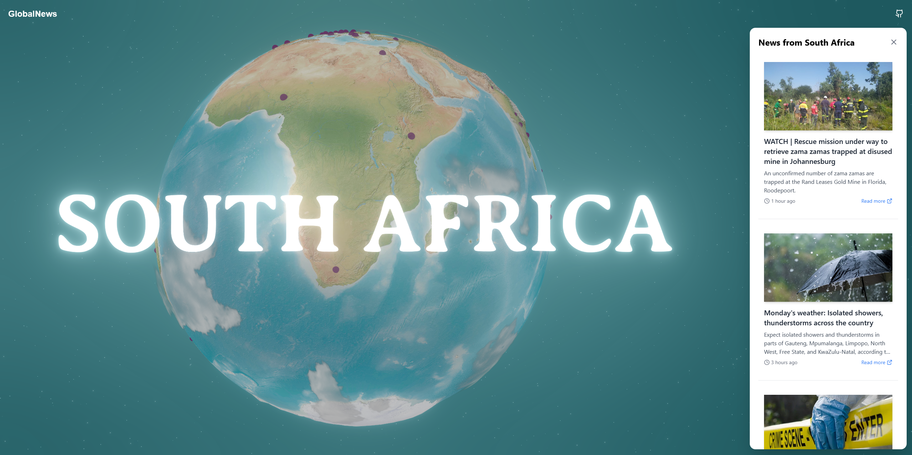

<h1 align="center">
  <br>
  
  <br>
  <br>
    Global News
  <br>
</h1>

<p align="center">
<a href="https://github.com/ajr-dev/global-news/fork" target="blank">

</a>
<a href="https://github.com/ajr-dev/global-news/stargazers" target="blank">

</a>
<a href="https://github.com/ajr-dev/global-news/pulls" target="blank">

</a>
</p>

A modern web application for viewing global news with an interactive globe visualization.

## 🚀 Features

- Interactive 3D globe visualization
- Latest trending news
- Responsive design

## Getting Started

### Prerequisites

- Node.js 18+ and npm

### Installation

1. Clone the repository:
```bash
git clone https://github.com/ajr-dev/global-news.git
cd global-news
npm install
```

2. Run the project:
```bash
npm run dev
```

## Tech Stack

- **Next.js**: A React framework for server-side rendering and generating static websites.
- **Tailwind CSS**: A utility-first CSS framework for rapid UI development.
- **Three.js**: A JavaScript library for creating 3D graphics.

## 💻 Usage

1. Open the Global News application in your browser.
2. Interact with the 3D globe to view news from different regions.

## Citation

If you utilize this repository, data in a downstream project, please consider citing it with:

```
@misc{global-news,
  author = {AJR},
  title = {A modern web application for viewing global news with an interactive globe visualization.},
  year = {2025},
  publisher = {GitHub},
  journal = {GitHub repository},
  howpublished = {\url{https://github.com/ajr-dev/global-news}},
```

## 🌟 Star history

[](https://star-history.com/#ajr-dev/global-news&Date)

## License

[Apache License 2.0](LICENSE)

## 🤗 Contributors

This is a community project, a special thanks to our contributors! 🤗

<a href="https://github.com/ajr-dev/global-news/graphs/contributors">
  
</a>